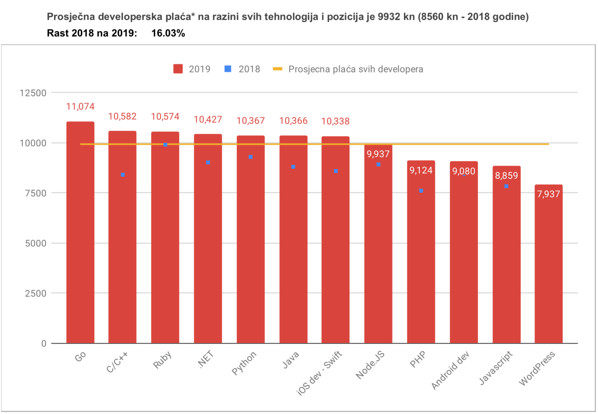

<table style="caret-color: #000000; font-family: Georgia;" border="0" cellspacing="0" cellpadding="0" >
            <tbody>
              <tr>
                <td valign="center">
                   								 </td>
              </tr>
  </tbody>
</table>

# Vježbe

- Obavezni dolasci na vježbe
- Kontrolne zadaće (blicevi) - 5 bliceva po 2 boda => 10% ocijene

# [Golang](https://golang.org/)

- **dizajniran u Google-u 2007. godine**
- **prva javna verzija - 2012. godine**
- **compiled (kompajliran)**

- **sintaksno statički jezik nalik na sintaksu C-a**

- **sa sakupljačem smeća**

## Compiled

**Go** radi izravno na osnovnom hardveru.

Python, Java, Scala itd. koriste kompilaciju jezika u byte-code koje razumije virtualna mašina koja radi nad operacijsskim sustavom. VM interpretira taj byte-code i pretvara ga u binarni kojeg procesor može razumjeti. 

**Go**, kao i npr. C/C++ se kompajlira direktno u binarne datoteke razumljive procesoru.

## Ostale bitne značajke Go-a

- [**Nema klasa**](https://golangbot.com/structs-instead-of-classes/) - sve je podjeljeno u **pakete**. **Go** ima samo **struct** tipove
- [**Ne podržava nasljeđivanje**](https://medium.com/@simplyianm/why-gos-structs-are-superior-to-class-based-inheritance-b661ba897c67)
- [**Nema konstruktora**](http://blog.j7mbo.com/bypassing-golangs-lack-of-constructors/)
- [**Nema generics-a**](https://blog.golang.org/why-generics)
- [**Nema iznimki**](https://medium.com/@hussachai/error-handling-in-go-a-quick-opinionated-guide-9199dd7c7f76)

## [**Why should you learn Go?**](https://medium.com/@kevalpatel2106/why-should-you-learn-go-f607681fad65)

# Razvojna okruženja

- [**Replit**](https://replit.com/)
- [**The Go Playground**](https://play.golang.org/)
- [**Goland**](https://www.jetbrains.com/go/)
- [**Visual Studio Code**](https://code.visualstudio.com/)
- ...

## Kako učiti

- [**A Tour of Go**](https://tour.golang.org/welcome/1)
- [**Effective Go**](https://golang.org/doc/effective_go.html)
- [**Go by Example**](https://gobyexample.com/)
- [**Project52 Golang Challenge**](https://github.com/kkdai/project52)
- [**The little Go book**](https://www.openmymind.net/assets/go/go.pdf)
- [**Golang tutorial series**](https://golangbot.com/learn-golang-series/)
- ...