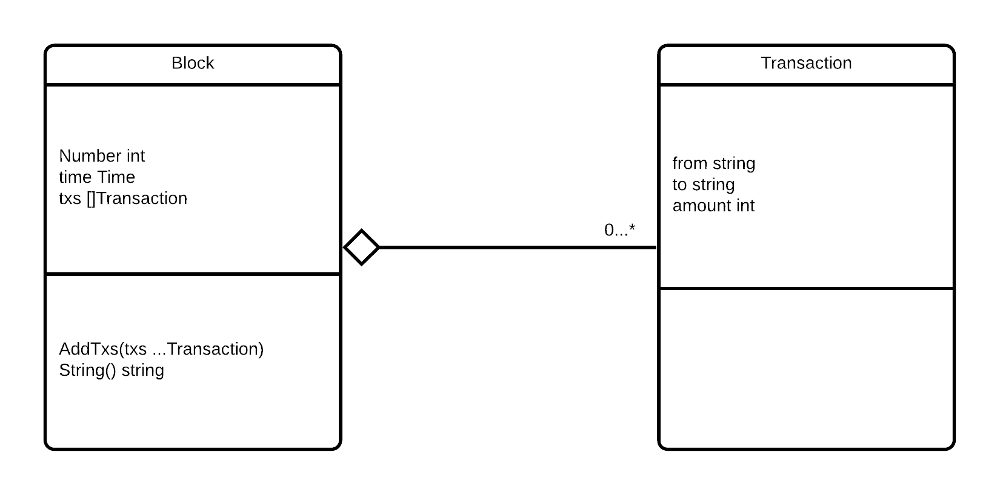

<div align="center">
<table style="caret-color: #000000; font-family: Georgia;" border="0" cellspacing="0" cellpadding="0" >
            <tbody>
              <tr>
                <td valign="center">
                  <a id="logo_a" href="https://fipu.unipu.hr"></a> 								 </td>
              </tr>
  </tbody>
</table>
</div>

<div align="center">

</div>


# Pokazivači

- Varijabla koja pohranjuje adresu memorije neke druge varijable
- Označava se sa `*`


```go
// Primjer

b := 255
var a *int = &b // sa & dohvaćamo adresu varijable
fmt.Printf("Type of a is %T\n", a)
fmt.Println("address of b is", a)
```


Vrijednost praznog pokazivača je **nil**

```go
a := 25
var b *int // b nema vrijednosti
if b == nil {
  fmt.Println("b is", b)
  b = &a
  fmt.Println("b after initialization is", b)
}
```


Možemo i kreirati pokazivač koji alocira vrijednost za potreban tip

```go
size := new(int) // kreira se pokazivač i vrijednost na koju pokazivač pokazuje
fmt.Printf("Size value is %d, type is %T, address is %v\n", *size, size, size)
*size = 85 // preko pokazivača mijenjamo vrijednost
fmt.Println("New size value is", *size)

```


Pristupanje i mijenjanje vrijednosti na koju pokazivač pokazuje

```go
b := 255
a := &b
// a++ - ovo ne može 
*a++
fmt.Println("address of b is", a)
fmt.Println("value of b is", *a)
```


# Strukture

- Korisnički definiran tip koji grupira podatke u jednu jedinicu

```go
// **Sintaksa**

type ImeStrukture struct {
  imePolja  tip
  imePolja2 tip
}
```


```go
// Primjer 

type Employee struct {  
    firstName string
    lastName  string
    age       int
  	salary    int
}
```

```go
// Korištenje strukture Employee


// ako navodimo imena polja tada je redosljed nebitan
// u tom slučaju nije potrebno niti popuniti sva polja
emp1 := Employee{
  firstName: "Sam",
  age:       25,
  salary:    500,
  lastName:  "Anderson",
}

// ako ne navodimo imena polja potrebno je predati vrijednosti za sva polja
// istim redosljedom kao što se nalaze u strukturi
emp2 := Employee{"Thomas", "Paul", 29, 800}
```


**Nulta vrijednost strukture**

- sva polja u strukturi poprimaju svoje nulte vrijednosti

```go
type Employee struct {  
    firstName, lastName string
    age, salary         int
}

func main() {  
    var emp4 Employee // struktura nulte vrijednosti
    fmt.Println("Employee 4", emp4) // Employee 4 {  0 0}
}
```


**Rad s poljima strukture**

- Koristi se operator **.** (točka)

```go
type Employee struct {  
    firstName, lastName string
    age, salary         int
}

func main() {  
    emp6 := Employee{"Sam", "Anderson", 55, 6000}
  
    fmt.Println("First Name:", emp6.firstName)
    fmt.Println("Last Name:", emp6.lastName)
  
  	emp6.age = 54
  	emp6.salary = 6100
    
  	fmt.Println("Age:", emp6.age)
    fmt.Printf("Salary: $%d", emp6.salary)
}
```


**Pokazivač na structuru**

```go
type Employee struct {  
    firstName, lastName string
    age, salary         int
}

func main() {  
    emp8 := &Employee{"Sam", "Anderson", 55, 6000}
    fmt.Println("First Name:", (*emp8).firstName)
    fmt.Println("Age:", (*emp8).age)
  
  	// ali nam jezik dopušta i bez *
    fmt.Println("First Name:", emp8.firstName)
    fmt.Println("Age:", emp8.age)
}
```


**Anonimna polja**

- Polje bez imena, definiran samo tip
- Za pristup koristimo ime tipa (što znači da je nije moguće imati duplikata)

```go
// Primjer

type Person struct {  
    string
    int
}

func main() {  
    p := Person{"Naveen", 50}
    fmt.Println(p)
  
  	// iako nemaju imena, kao ime možemo koristiti njegov tip
  
    p.string = "naveen"
    p.int = 51
    fmt.Println(p)
}
```


**Ugnježdene strukture**

- Polje unutar strukture je struktura

```go
type Address struct {  
    city, state string
}
type Person struct {  
    name string
    age int
    address Address
}

func main() {  
    var p Person
    p.name = "Naveen"
    p.age = 50
    p.address = Address {
        city: "Chicago",
        state: "Illinois",
    }
    fmt.Println("Name:", p.name)
    fmt.Println("Age:",p.age)
    fmt.Println("City:",p.address.city)
    fmt.Println("State:",p.address.state)
}
```


**Promoted polja**

- Polje koje pripada **anonimnoj** strukturnom polju

```go
type Address struct {  
    city, state string
}
type Person struct {  
    name string
    age  int
    Address
}

func main() {  
    var p Person
    p.name = "Naveen"
    p.age = 50
    p.Address = Address{
        city:  "Chicago",
        state: "Illinois",
    }
    fmt.Println("Name:", p.name)
    fmt.Println("Age:", p.age)
    fmt.Println("City:", p.city) //city je promoted polje
    fmt.Println("State:", p.state) //state je promoted polje
}
```


**Stukture i polja za izvoz**

- Ako struktura počinje s velikim slovom onda se može izvesti i koristiti u drugim paketima
- Ako polje ili struktura počinje s velikim slovom, može joj se pristupiti iz drugih paketa


Pretpostavimo da imamo direktorij **computer** i u tom direktoriju datoteku **spec.go**

```go
// spec.go
package computer

type Spec struct { //exported struct  
    Maker string //exported field
    model string //unexported field
    Price int //exported field
}
```


U **main.go** datoteci možemo koristiti taj paket, zajedno s definiranom sturkturom

```go
package main

import (
	"computer"
  "fmt"
)

func main() {  
    var spec computer.Spec
    spec.Maker = "apple"
    spec.Price = 50000
  	// spec.model -> ovo ne možemo
    fmt.Println("Spec:", spec)
}
```


**Jednakost struktura**

- Strukture su vrijednosti tipovi, te se mogu uspoređivati ako su njezina polja uspoređiva
- Dvije strukture se smatraju jednakim ako su vrijednosti polja tih struktura jednaka

```go
type name struct {  
    firstName string
    lastName string
}


func main() {  
    name1 := name{"Steve", "Jobs"}
    name2 := name{"Steve", "Jobs"}
    if name1 == name2 {
        fmt.Println("name1 and name2 are equal")
    } else {
        fmt.Println("name1 and name2 are not equal")
    }

    name3 := name{firstName:"Steve", lastName:"Jobs"}
    name4 := name{}
    name4.firstName = "Steve"
    if name3 == name4 {
        fmt.Println("name3 and name4 are equal")
    } else {
        fmt.Println("name3 and name4 are not equal")
    }
}

// name1 and name2 are equal  
// name3 and name4 are not equal
```


## Metode struktura

- **Metoda** je funkcija s specijalim prijemnikom između ključne riječi **func** i imena metode

   

```go
// **Sintaksa**
func (t Type) imeMetode(parametar tip) {
  
}
```


```go
// Primjer
type Employee struct {  
    name     string
    salary   int
    currency string
}

/*
 displaySalary() - metoda Employee strukture
*/
func (e Employee) displaySalary() {  
    fmt.Printf("Salary of %s is %s%d", e.name, e.currency, e.salary)
}

func main() {  
    emp1 := Employee {
        name:     "Sam Adolf",
        salary:   5000,
        currency: "$",
    }
    emp1.displaySalary() // pozivanje displaySalary() metode
}
```


**Vrijednosni prijemnici vs prijemnik-pokazivač**

- Moguće je kreirati metode koje kao prijemnika imaju pokazivač
- Promjene napravljene u metodi s prijemnikom-pokazivačem su vidljive pozivatelju


```go
type Employee struct {  
    name string
    age  int
}

/*
Metoda s vrijednosnim prijemnikom
*/
func (e Employee) changeName(newName string) {  
    e.name = newName
}

/*
Metoda s pokazivačem kao prijemnik
*/
func (e *Employee) changeAge(newAge int) {  
    e.age = newAge
}

func main() {  
    e := Employee{
        name: "Mark Andrew",
        age:  50,
    }
  
    fmt.Printf("Employee ime prije promjene: %s", e.name)
    e.changeName("Michael Andrew")
    fmt.Printf("\nEmployee ime nakon promjene: %s", e.name)

    fmt.Printf("\n\nEmployee godina prije promjene: %d", e.age)
    e.changeAge(51)
    fmt.Printf("\nEmployee godina nakon promjene: %d", e.age)
}

// Employee ime prije promjene: Mark Andrew
// Employee ime nakon promjene: Mark Andrew

// Employee godina prije promjene: 50
// Employee godina nakon promjene: 51
```

 

**Kada koristiti kada prijemnike-pokazivače?**

- Kada promjene napravljene na prijemniku unutar metode moraju biti vidljive pozivatelju
- Kada je skupo kopirati strukturu podataka 
  - Npr. struktura ima puno polja:
    - Korištenjem takve strukture kao vrijednosni prijemnik zahtjeva kopiranje cijele strukture što može koštati
    - U tom slučaju, ako se koristi pokazivač, struktura se neće kopirati


**Metode anonimnog strukturnog polja mogu se pozivati kao da pripadaju strukturi**

```go
type address struct {  
    city  string
    state string
}

func (a address) fullAddress() {  
    fmt.Printf("Full address: %s, %s", a.city, a.state)
}

type person struct {  
    firstName string
    lastName  string
    address
}

func main() {  
    p := person{
        firstName: "Elon",
        lastName:  "Musk",
        address: address {
            city:  "Los Angeles",
            state: "California",
        },
    }

    p.fullAddress() // pristupamo fullAddress metodi iz address strukture

}
```


**Strukture nemaju konstruktor**

- Uobičajeno je napisati "pomoćnu** funkciju koja kreira strukturu iz predanih parametara

```go

type Employee struct {  
    name     string
    salary   int
    currency string
}

/*
 displaySalary() - metoda Employee strukture
*/
func (e *Employee) displaySalary() {  
    fmt.Printf("Salary of %s is %s%d", e.name, e.currency, e.salary)
}


func NewEmployee(name string, salary int, currency string) *Employee {
  e :=  &Employee {
        name:     name,
        salary:   salary,
        currency: currency,
    }
  return e
}


func main() {  
	  emp := NewEmployee("Sam Adolf", 5000,"$")
    emp.displaySalary()
}
```


### Metode na ne-strukturnim prijemnicima

- Moguće je kreirati metode na ostalim tipovima podataka
- Uvjet je da su definicija tipa i metode u istom **paketu**


```go
// Primjer

package main

// Ovo neće raditi jer je int built-in tip koji nije u ovom paketu
func (a int) add(b int) {  
}

func main() {

}
```


```go
package main

import "fmt"

// ali zato možemo definirati alias za int
// definicija tipa myInt je u istom paketu (u ovom slučaju i u istoj datoteci) kao i metoda
type myInt int

func (a myInt) add(b myInt) myInt {  
    return a + b
}

func main() {  
    num1 := myInt(5)
    num2 := myInt(10)
    sum := num1.add(num2)
    fmt.Println("Suma je", sum)
}
```


# Interface

- Specificira metode koje tip mora imati
- Tip odlučuje kako će implementirati te metode

```go
// **Sintaksa** - deklaracija interface-a

type ImeInterfacea interface {  
    Metoda(parametri) povratniTip
    ...  
}
```

```go
package main

import "fmt"

// Primjer

type VowelsFinder interface {
	FindVowels() []rune
}

type MyString string

// MyString implementira VowelsFinder
func (ms MyString) FindVowels() []rune { 
	var vowels []rune // rune je tipa int32 što string vraća kada se iterira string
	for _, rune := range ms {
		if rune == 'a' || rune == 'e' || rune == 'i' || rune == 'o' || rune == 'u' {
			vowels = append(vowels, rune)
		}
	}
	return vowels
}

func main() {
	name := MyString("Sam Anderson")
	var v VowelsFinder
	v = name // moguće jer MyString implementira VowelsFinder
	fmt.Printf("Vowels are %c", v.FindVowels())

}
```


**Prazno sučelje**

- Sučelje koje nema metoda
- Reprezentirano kao `interface{}`
- Zato što nema metoda, svi tipovi implementiraju to sučelje

```go
func describe(i interface{}) {  
    fmt.Printf("Type = %T, value = %v\n", i, i)
}

func main() {  
    s := "Hello World"
    describe(s)
    i := 55
    describe(i)
    strt := struct {
        name string
    }{
        name: "Naveen R",
    }
    describe(strt)
}
```


**Casting**

- Izvlačenje vrijednosti sučelja
- `val.(T)` - sintaksa dohvaćanja vrijednosti `i` interface-a, čiji je tip `T`

```go
func assert(i interface{}) {  
    s := i.(int) // dohvati tip sučelja i (ovdje znamo da je tip int)
    fmt.Println(s)
}
func main() {  
    var s interface{} = 56
    assert(s)
}
```

**Ako neznamo kojeg tipa je sučelje?**

- Koristimo sintaksu `v, ok := i.(T)`

```go
func assert(i interface{}) {  
  	// ok vraća točnost pretvorbe tipa
    v, ok := i.(int)
    fmt.Println(v, ok)
}
func main() {  
    var s interface{} = 56
    assert(s)
    var i interface{} = "Steven Paul"
    assert(i)
}
```


**Type Switch**

- Tražimo tip unutar višestrukih mogućnosti

```go
func findType(i interface{}) {
    switch i.(type) { // dohvaćamo tip ispod sučelja
    case string:
        fmt.Printf("Ja sam string i moja vrijednost je %s\n", i.(string))
    case int:
        fmt.Printf("Ja sam int i moja vrijednost je %d\n", i.(int))
    default:
        fmt.Printf("Neznam što sam\n")
    }
}
func main() {  
    findType("Naveen")
    findType(77)
    findType(89.98)
}
```


# Zadaci


1. Game store

   - Deklariraj strukture

     - item: id (int), name (string), price (int)
     - game: anonimno polje item, genre (string)

   - Kreiraj game slice s podacima:

     | id   | name       | price | Genre            |
     | ---- | ---------- | ----- | ---------------- |
     | 1    | god of war | 50    | action adventure |
     | 2    | x-com 2    | 30    | strategy         |
     | 3    | minecraft  | 20    | sandbox          |

   - Iteriraj kroz slice i ispiši sve podatke struktura

   

2. Transakcijski blok

   - Deklarairaj strukture
     - Transaction: from (string), to (string), amount (int)
     - Block: Number (int), time (Time), slice struktura Transaction 
   - Kreiraj funkciju koja služi kao konstruktor `Block`-a i prima parametar `number`
     - funkcija u novo kreirani blok upisuje trenutno vrijeme
     - inicijalizira Transaction slice
   - `Block` ima metodu `AddTxs` kroz koju se može dodati jedna ili više struktura `Transaction` u popis transakcija bloka
   - `Block` nadjačava metodu `String()` u kojoj vraća `string` s informacijama o bloku i transakcijama
   
   
