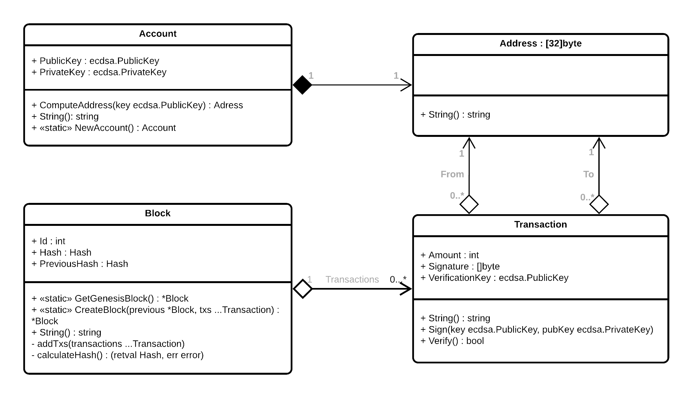

<table style="caret-color: #000000; font-family: Georgia;" border="0" cellspacing="0" cellpadding="0" >
            <tbody>
              <tr>
                <td valign="center">
                  <a id="logo_a" href="https://fipu.unipu.hr"></a> 								 </td>
              </tr>
  </tbody>
</table>


# Simplecoin

- Kreirat poddirektorij `simplecoin`  s sljedećim strukturama



## main.go

```go
package main

import (
   "simplecoin"
)

func main() {
   a1 := simplecoin.NewAccount()
   a2 := simplecoin.NewAccount()

   t1 := simplecoin.NewTransaction(a1.Address, a2.Address, 1000)
   t1.Sign(a1.PrivateKey, a1.PublicKey) // a1 potpisuje

   bGenesis := simplecoin.GetGenesisBlock()
   b1 := simplecoin.CreateBlock(bGenesis, *t1) // kreiraj novi blok

   t2 := simplecoin.NewTransaction(a2.Address, a1.Address, 10)
   t2.Sign(a2.PrivateKey, a2.PublicKey)

   b2 := simplecoin.CreateBlock(b1, *t1, *t2)
   _ = b2
}
```


## Proof of work (pseudokod)

- Doraditi **CreateBlock** metodu da nakon dodavanja transakcija riješi kriptografski zadatak
- Koristiti strukturu **big.Int** za 256-bitne integere
- Kao metodu za izračun *hash*a koristiti dvostruki sha256 
- Ispisati vrijeme potrebno za izračun i brzinu primjene hasha (MH/s) 

```pseudocode
funkcija Mine (tezina, hash_bloka) {
    nonce = big.Int postavljen na nulu
	
  	for {
				byteovi = konkateniraj(nonce, hash_bloka) 
				kandidat = sha256(sha256(byteovi))
				
        y_limit = 2 na potenciju (256 - tezina)
        y = new(big.Int).SetBytes(kandidat[:])
        if y < y_limit { 
        		return nonce
        }
        
        nonce += 1 
        }
}
```

