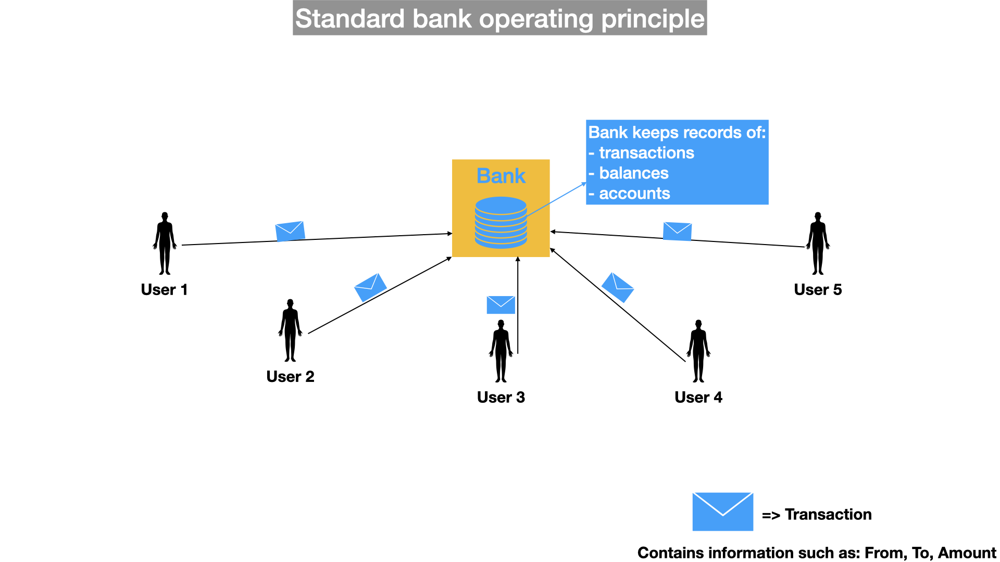
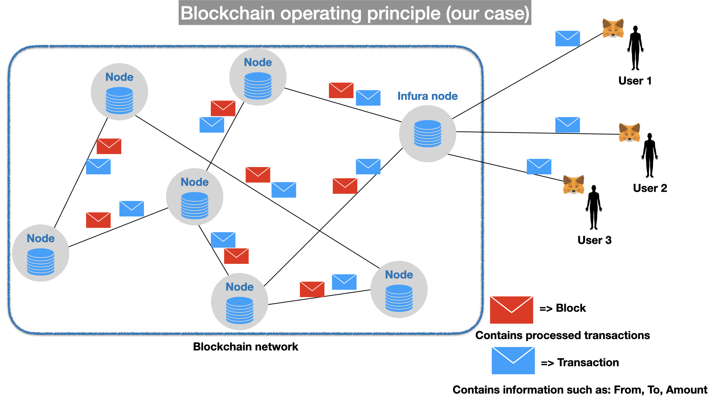

<div align="center">
<table style="caret-color: #000000; font-family: Georgia;" border="0" cellspacing="0" cellpadding="0" >
            <tbody>
              <tr>
                <td valign="center">
                  <a id="logo_a" href="https://fipu.unipu.hr"></a> 								 </td>
              </tr>
  </tbody>
</table>
</div>


<div align="center">
  
</div>


### Modus operandi of banks

One centralized entity holds all money, processes all transactions and keeps track of users balances. To transfer money from one account to another, we must send a transaction request to the one central bank that will update it's local databse records.




### Blockchain operating principle

In blockchain network, all nodes act as a bank, thus storing transactions, keeping records of users and their transactions. When knowing all transactions of a account, it is easy to calculate current balance of an account. Since the balance is to calculate, current balances of users are commonly only stored in memory. Consensus algorithms asists these nodes to synchronise their local records about transaction and block history (blockchain). If there was no consensus, each node would act as a single bank entity. 

As a **user**, we incur similar problem as nodes joining the peer-to-peer network, that is, we don't know how can we join to the network. For this we can use some commonly used nodes (in this example [Infura](https://infura.io/)), or we can start our own node. It is important that the node we are connecting to, is synchronised with the rest of the network, so we can get accurate information about our (and other user's) balance. User uses it's crypto wallet provider (in our case [Metamask](https://metamask.io/) chrome extension) to create and send a transactions to a node in the blockchain network.





# [Solidity](https://solidity.readthedocs.io/en/v0.5.14/)

`An object-oriented, high-level language for implementing smart contracts. Smart contracts are programs which govern the behaviour of accounts within the Ethereum state.`

Korisne poveznice

- [MetaMask](https://metamask.io/)
- [faucet - Ropsten](https://faucet.metamask.io/)
- [faucet - Goerli](https://goerli-faucet.slock.it/)
- [Remix IDE](https://remix.ethereum.org/)
- [Etherscan](https://etherscan.io/)


## Tipovi podataka

- *Boolean* (**bool**) true/false
   – logički operatori: **! && || ==**
- *Integer* (**int**, **uint**)
   – dostupne razne veličine: **uint8**, **uint16**, ..., **uint256** – sa ili bez predznaka (*signed, unsigned*)
   – ako nije navedeno podrazumijeva se 256 bita
- *Fixed point* (**fixed, ufixed**)
  - **Not fully supported yet!** – deklarirani sa (u)fixedMxN
  - M označava veličinu u bitovima, a N broj decimalnih mjesta
- *Adresa* (**address**)
  - specijalni tip koji sadržava Ethereum adresu (20 bytea)


# Složeniji tipovi

- *Enum* (**enum**)
  - pr: **enum** **NAZIV** {**JEDAN**, **DVA**, **TRI**, ...}
- *Byte array* (**bytes1**, ..., **bytes32**)
  - Polje byteova fiksne veličine
- *Byte array* (**bytes**, **string**)
   – dinamične veličine, koristi se i za tekstualne nizove
- *Array* 
  - polje bilo kojeg tipa, veličina može i ne mora biti određena
  - npr. **uint32 \[]\[5]** **primjerPolja**;
  - **dodavanje** u polje: **primjerPolja.push(...)**; 
  - **duljina** polja: **primjerPolja.length**;
- *Struct* (**struct**)
  - grupiranje varijabli
  - **struct** Naziv {**<tip>** atr1; **<tip>** atr2; ...}
  - inicijalizacija
    - Naziv s1 = Naziv (var1, var2)
    - Naziv s2 = Naziv ({atr1: var1, atr2: var2})
- *Mapping* (mapping)
  - Rječnik - *hash lookup table*
  - Pridružuje vrijednost ključevima
  - mapping (**<tipKljuca>** => **<tipVrijednosti>**)


## Pomoćni tipovi

- Vremenske oznake

  - seconds
  - minutes
  - hours
  - days

  ```php
  // Vrijeme depozita
  uint256 public brojSekundi = 4 days; 
  // Ista stvar
  uint256 public brojSekundi2 = 345600;
  ```

- Vrijednosne oznake

  - wei
  - finney
  - szabo
  - ether

  ```php
  // Iznos depozita
  uint256 public iznos = 0.05 ether;
  // Ista stvar
  uint256 public iznos2 = 50000000000000000;
  ```

  

## Predefinirane varijable

Objekt <span style="color:blue">msg</span> sadrži podatke o transakciji koja je inicirala izvršavanje ugovora:

- <span style="color:blue">msg.sender</span> - adresa koja je pozvala transakciju
- <span style="color:blue">msg.value</span> - vrijednost (wei) koja je pridodana transakciji
- <span style="color:blue">msg.gas</span> - preostala količina goriva za izvršavanje ugovora
- <span style="color:blue">msg.data</span> - podaci vezani uz transakciju
- <span style="color:blue">msg.sig</span> - prva četiri bytea podataka (oznaka funkcije)


Objekt <span style="color:blue">block</span> sadrži podatke o trenutnom bloku:

- <span style="color:blue">block.coinbase</span> - adresa koja prima nagradu za trenutni blok
- <span style="color:blue">block.difficulty</span> - PoW težina trenutnog bloka
- <span style="color:blue">block.gaslimit</span> - maksimalna količina gasa za sve transakcije
- <span style="color:blue">block.number</span> - visina bloka
- <span style="color:blue">block.timestamp</span> - UNIX timestamp (sekunde)


## Tip podataka <span style="color:blue">address</span>

Varijeble tipa address sadrže sljedeće atribute i metode:

- <span style="color:blue">address.balance</span>
 - Vrijednost (**wei**) na računu
- <span style="color:blue">address.transfer(amount)</span>
 - Prijenos vrijednosti s ugovora na račun. Baca **exception** kod greške.
- <span style="color:blue">address.send(amount)</span>
 -
 Prijenos vrijednosti, ali **send** ne baca exception, nego vraća **false**
- Naprednije *low-level* metode:
  - <span style="color:blue">address.call(payload)</span>

  - <span style="color:blue">address.callcode(payload)</span>

  - <span style="color:blue">address.delegatecall()</span> <span style="color:red">
=> oprez!
</span>


Primjer tipova podataka

```php
pragma solidity ^0.5.0;

contract DataTypes {
    
    bool public b;
    uint public i;
    int public j;
    address public adresa;
    string public nazivUgovora;
    
    enum Stanje {Prvo, Drugo, Trece} 
    struct Osoba {string Ime; string Prezime; }
    
    Stanje public stanjeUgovora;
    Osoba public vlasnikUgovora;
    
    uint[] public polje_intova;
    
    mapping (uint => uint) public stanjeNovaca;
    
    function usporedba() public view returns(bool) {
        return keccak256("DataTypes") == keccak256(bytes(nazivUgovora));
    }
    
    function duljina() public view returns(uint) {
        return polje_intova.length;
    }
    
    constructor() public {
        b = true;
        i = 1;
        i -= 2;
        j = 1;
        j -= 2;
        polje_intova.push(1);
        polje_intova.push(2);
        nazivUgovora = "DataTypes";
        adresa = address(this);
        stanjeUgovora = Stanje.Prvo;
        stanjeUgovora = Stanje(uint8(stanjeUgovora)+1);
        stanjeNovaca[0] = 100;
        stanjeNovaca[1] = 101;
        vlasnikUgovora.Ime = "Ivo";
        vlasnikUgovora.Prezime = "Ivić";
    }
}
```

