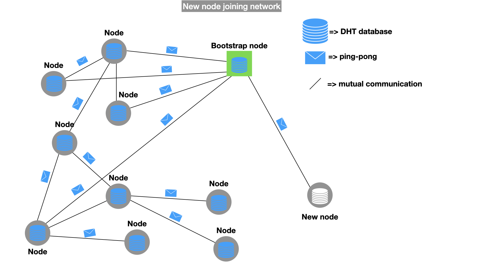
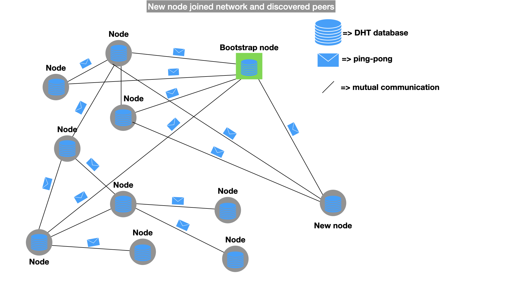
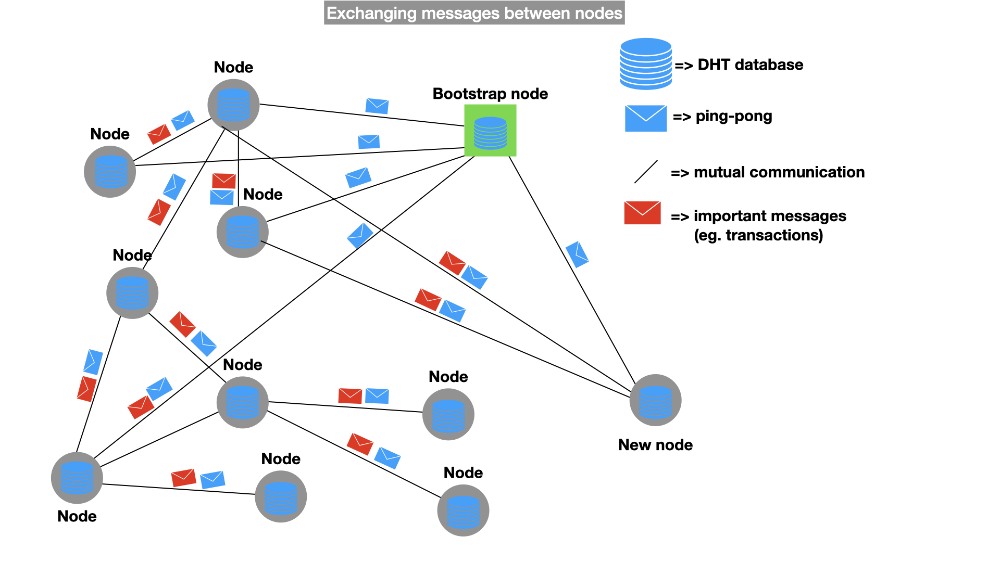
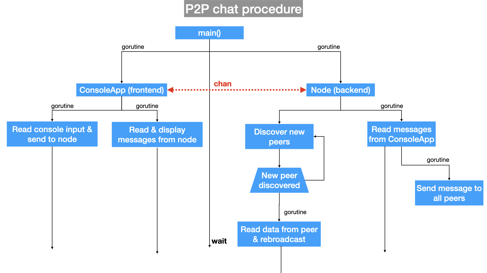

<table style="caret-color: #000000; font-family: Georgia;" border="0" cellspacing="0" cellpadding="0" >
            <tbody>
              <tr>
                <td valign="center">
                   								 </td>
              </tr>
  </tbody>
</table>

# P2P chat

P2P chat implementation using [go-libp2p](https://github.com/libp2p/go-libp2p) (also see [libp2p](https://github.com/libp2p)).

### Peer lifecycle

---

In first stage, new node joins using one (or more) Bootstrap node(s) which acts as a sort of an entrance to the world of peer-to-peer network. Each peers locally stores a distributed hash table of it's near peers. Distance between peers is not based geographically, rather using other metrics (see [Kademlia](https://en.wikipedia.org/wiki/Kademlia)). Bootstrap node contains a much larger DHT table, compared to other nodes, so it can offer a greater spectre of possible nodes to a new joining node.

In second stage, new joining node, after filling its own DHT table with node adresess received from bootstrap node, starts contacting and forming connections with other nodes in the network. A (neighbour) node to which a node establishes connection with, is called **peer**. So, terminology is: a node is communicating with it's peers.

After establishing connections, new node can proceed to participate in the main algorithm objective, which in terms of Blockchain is exchanging transactions and blocks.

Implementation details: modules, communication between modules and the number of goroutines.

