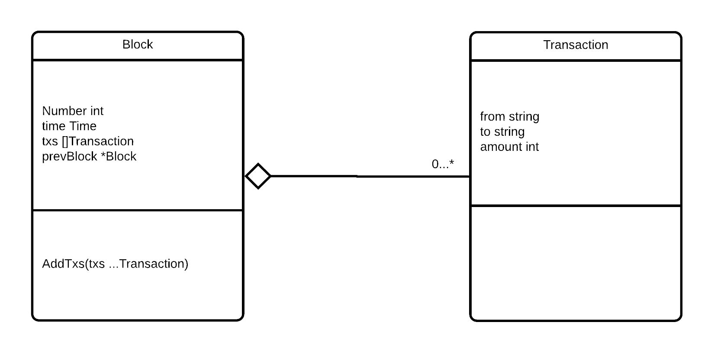

<table style="caret-color: #000000; font-family: Georgia;" border="0" cellspacing="0" cellpadding="0" >
            <tbody>
              <tr>
                <td valign="center">
                   								 </td>
              </tr>
  </tbody>
</table>

# 1. Blic - lanac blokova

- Kreiraj strukture s klasnog diagrama
- Kreiraj funkciju `GetGenesisBlock` koja uvijek vraća isti ("prazan") blok
- Kreiraj funkciju `CreateBlock` koja služi kao konstruktor `Block`-a i prima parametare `number` i `previousBlock`
  - funkcija u novo kreirani blok upisuje trenutno vrijeme, Number varijablu, te postavlja referencu na prethodni blok
  - inicijalizira Transaction slice
- `Block` ima metodu `AddTxs` kroz koju se može dodati jedna ili više struktura `Transaction` u popis transakcija bloka
- U `main` funkciji kreirajte 2 bloka pomoću funkcije `CreateBlock`
  - Prilikom kreiranja prvog bloka, za `prevBlock` uzima se block koji vraća `GetGenesisBlock`
  - U prvi blok dodajte 2 transakcije
